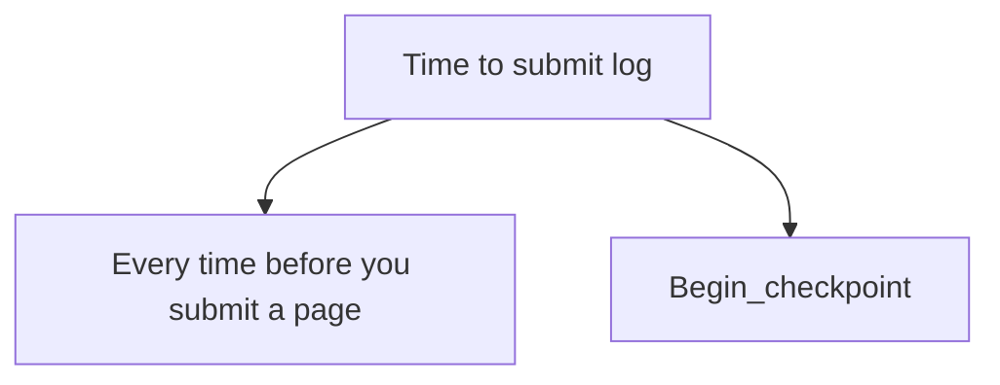

- According to WAL, you have to force the log page to stable storage before you force a page to stable storage. 
- Two important recovery-related data structures: **transaction table** and **dirty page table**. Transaction table records the **transaction id** and **lastLSN**, of which are still active when a crash occurs. Dirty page table contains the entry for each dirty page, which covers a field **recLSN**.
  - lastLSN is LSN of the most recent log record for the transaction. Together with the prevLSN(linked list) in log we can generate the undo list.
  - recLSN is the LSN of the first log record that make the page to become dirty. Compare all the recLSN of dirty page table(find the earliest one), we can determine the log to start when restarting.
  - The corresponding dirty page will not be removed until the commit, during which the transaction have no access to the page. So if we've not forced the page to stable storage, we have redo all the related logs.
- To reduce the amount of work done during the restart, we need to have a snapshot called checkpoint periodically, which includes three phases: **begin_checkpoint**, **end_checkpoint**, **master** record containing the LSN of begin_checkpoint written to a known place on stable storage.
  - end_checkpoint records the contents of **transaction table** and **dirty table** at **begin_checkpoint**. Meanwhile, DBMS continues executing transactions and writing other log records.
  - During the restart, we only need to start from the begin_checking by examining the known place on stable storage, and forward until end_checkpoint to get the transaction table and dirty page table then go back to begin_checkpoint and forward again to implement the logs between the begin_checkpoint and end_checkpoint and to the end of log.

